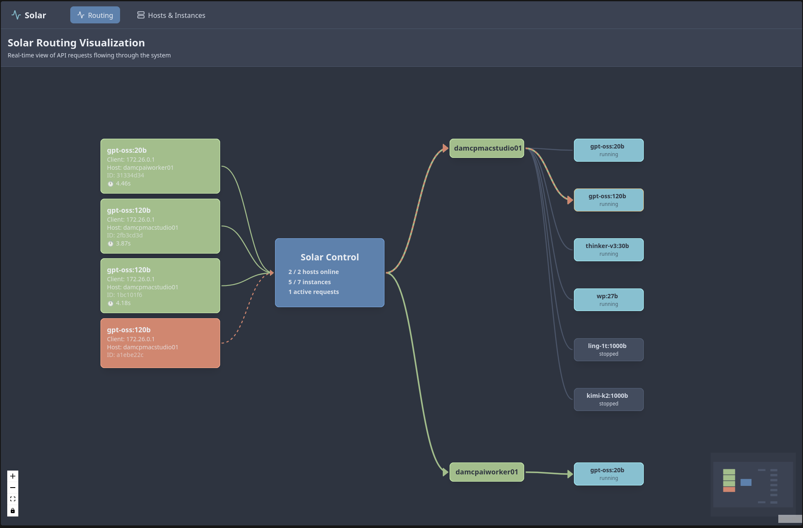
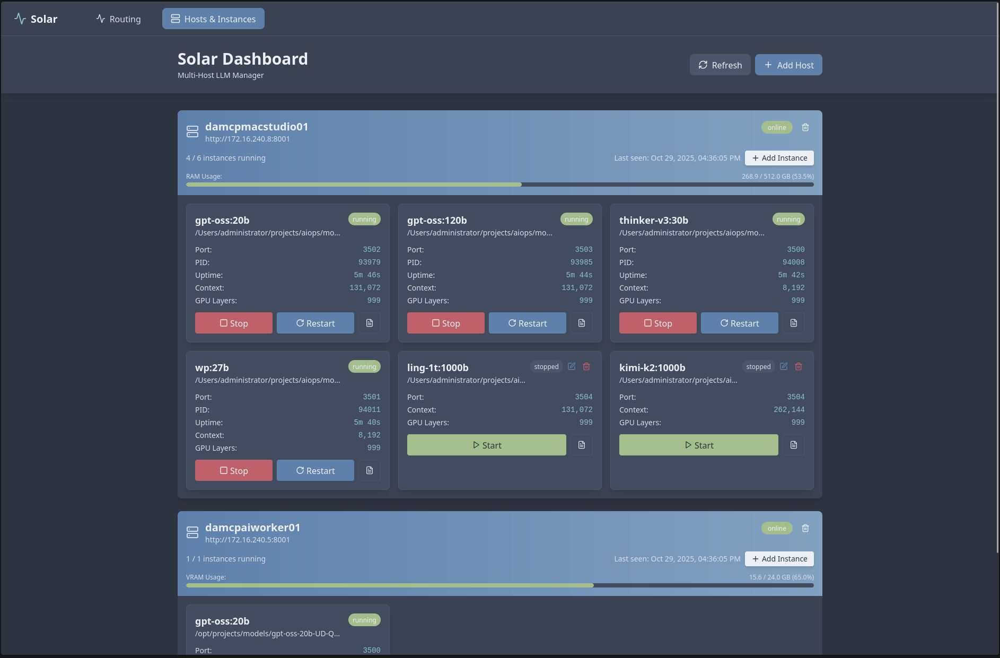

# Solar WebUI

A modern React dashboard for managing distributed AI model deployments through solar-host and solar-control. Supports multiple backend types including llama.cpp and HuggingFace models.

## Preview

### Real-Time Routing Visualization
Watch your API requests flow through the system in real-time with an interactive network graph.



### Dashboard & Instance Management
Manage all your hosts and model instances from a beautiful, unified interface.



## Features

- **Multi-backend support** - Manage llama.cpp, HuggingFace Causal LM, Classification, and Embedding models
- **Real-time routing visualization** - Interactive network graph showing API request flow
- **Dashboard view** - Manage all solar-hosts and model instances
- **Live log streaming** - Real-time WebSocket log viewer for each instance
- **Instance management** - Start, stop, restart, create, edit, and delete instances
- **Host management** - Add, remove, and monitor solar-host connections
- **Backend-aware UI** - Visual distinction between backend types with icons and colors
- **Nord dark theme** - Beautiful arctic-inspired color scheme
- **Modern UI** - Built with React, TypeScript, Vite, and Tailwind CSS

## Supported Backend Types

| Backend | Icon | Description |
|---------|------|-------------|
| **llama.cpp** | 🔵 CPU | GGUF models via llama-server |
| **HuggingFace Causal** | 🟢 Brain | Text generation models (AutoModelForCausalLM) |
| **HuggingFace Classification** | 🟡 Tags | Sequence classification models (AutoModelForSequenceClassification) |
| **HuggingFace Embedding** | 🟣 Binary | Embedding models using last hidden state (AutoModel) |

## Installation

```bash
# Install dependencies
npm install
```

## Configuration

The webui now ships with a built-in middleware proxy with **HTTP keep-alive optimizations** for low-latency performance. Configure it using environment variables (either via a `.env` file or by exporting them in your shell):

```bash
# URL of your solar-control deployment
SOLAR_CONTROL_URL=http://localhost:8000

# API key required by solar-control
SOLAR_CONTROL_API_KEY=your-solar-control-api-key

# Optional: port for the middleware server (defaults to 8080)
# PORT=8080

# Optional: enable debug logging for proxy requests
# SOLAR_WEBUI_DEBUG=true
```

These values are consumed both by the Vite development proxy and the production middleware server. They are never exposed to the browser.

### Performance Optimizations

The middleware server includes several performance optimizations:
- **HTTP Keep-Alive** - Reuses TCP connections to reduce latency (5-20ms vs 50-100ms)
- **Connection Pooling** - Maintains up to 50 concurrent connections with 10 idle connections ready
- **WebSocket Upgrade Handling** - Explicit upgrade event handling ensures no dropped connections
- **Compression** - Gzip compression for static assets
- **ETag Disabled** - Reduces overhead for proxied requests

## Development

```bash
# Start development server
npm run dev
```

The application will be available at `http://localhost:5173`. The dev server proxies `/api/control/*` and related WebSocket routes to `SOLAR_CONTROL_URL`, injecting the API key from your environment variables.

## Production Deployment

### Option 1: Docker (Recommended)

**Quick Start:**

```bash
# Export the required variables (or place them in docker-compose.env)
export SOLAR_CONTROL_URL=http://host.docker.internal:8015
export SOLAR_CONTROL_API_KEY=your-solar-control-api-key
export PORT=8080  # optional

# Build and start
docker-compose up -d

# View logs
docker-compose logs -f

# Stop
docker-compose down
```

**Important Docker Notes:**

- The middleware listens on `http://localhost:PORT` (default `8080`)
- Uses `host.docker.internal` to access solar-control running on the host machine
- Environment variables are read at container runtime—no rebuild is required when they change

### Option 2: Build for Production (Native)

```bash
npm run build
SOLAR_CONTROL_URL=http://localhost:8000 SOLAR_CONTROL_API_KEY=your-key npm start
```

This builds the React assets and launches the Node middleware (`npm start` is an alias for `npm run serve`). The middleware serves both static files and all API/WebSocket requests, so you do **not** need an additional reverse proxy unless you want TLS or custom routing. Changes to environment variables take effect on the next process restart.

## Project Structure

```
src/
├── main.tsx                    # Entry point
├── App.tsx                     # Main app with routing and navigation
├── index.css                   # Global styles with Nord theme
├── api/
│   ├── client.ts               # Axios client configuration
│   └── types.ts                # TypeScript type definitions (multi-backend)
├── components/
│   ├── RoutingGraph.tsx        # Real-time routing visualization
│   ├── Dashboard.tsx           # Hosts & instances dashboard
│   ├── HostCard.tsx            # Host display card with backend summary
│   ├── InstanceCard.tsx        # Instance display card (backend-aware)
│   ├── LogViewer.tsx           # Real-time log viewer modal
│   ├── AddHostModal.tsx        # Add host modal
│   ├── AddInstanceModal.tsx    # Create instance modal (multi-backend)
│   └── EditInstanceModal.tsx   # Edit instance modal (backend-aware)
├── hooks/
│   ├── useWebSocket.ts         # WebSocket management hook
│   ├── useInstances.ts         # Instance data management hook
│   ├── useHostStatus.ts        # Real-time host status updates
│   └── useRoutingEvents.ts     # Routing event stream handler
└── lib/
    └── utils.ts                # Utility functions (Nord theme helpers)
```

## Usage

1. **Configure** `SOLAR_CONTROL_URL` and `SOLAR_CONTROL_API_KEY` in your environment
2. **Navigate** to the Routing page (default view) to monitor request flow
3. **Add Hosts** through the "Hosts & Instances" page
4. **Create Instances** - Select backend type (llama.cpp, HuggingFace Causal, or Classification)
5. **Manage Instances** - Start, stop, edit, or delete model instances
6. **View Logs** - Click the log icon on any instance for real-time output
7. **Monitor Performance** - Watch the routing graph to see load distribution

## Creating Instances

### llama.cpp Instance
- **Model Path**: Path to GGUF model file
- **Alias**: Model identifier for API routing
- **GPU Layers, Context Size, Threads**: Hardware configuration
- **Sampling Parameters**: Temperature, Top-P, Top-K, Min-P

### HuggingFace Causal LM Instance
- **Model ID**: HuggingFace model ID or local path
- **Alias**: Model identifier for API routing
- **Device**: `auto`, `cuda`, `mps`, or `cpu`
- **Dtype**: `auto`, `float16`, `bfloat16`, or `float32`
- **Max Length**: Maximum sequence length
- **Flash Attention**: Enable for faster inference on compatible GPUs

### HuggingFace Classification Instance
- **Model ID**: HuggingFace model ID or local path
- **Alias**: Model identifier for API routing
- **Device**: `auto`, `cuda`, `mps`, or `cpu`
- **Dtype**: `auto`, `float16`, `bfloat16`, or `float32`
- **Max Length**: Maximum sequence length
- **Labels**: Optional custom label names

### HuggingFace Embedding Instance
- **Model ID**: HuggingFace model ID or local path (e.g., `sentence-transformers/all-MiniLM-L6-v2`)
- **Alias**: Model identifier for API routing
- **Device**: `auto`, `cuda`, `mps`, or `cpu`
- **Dtype**: `auto`, `float16`, `bfloat16`, or `float32`
- **Max Length**: Maximum sequence length
- **Normalize Embeddings**: L2 normalize output vectors (recommended for similarity search)

## Technology Stack

- **React 18** - Modern UI library
- **TypeScript** - Type-safe JavaScript
- **Vite** - Fast build tool and dev server
- **Tailwind CSS** - Utility-first CSS framework with Nord theme
- **React Flow** - Interactive node-based graphs for routing visualization
- **Axios** - HTTP client for API communication
- **Lucide Icons** - Beautiful icon library
- **Zustand** - Lightweight state management
